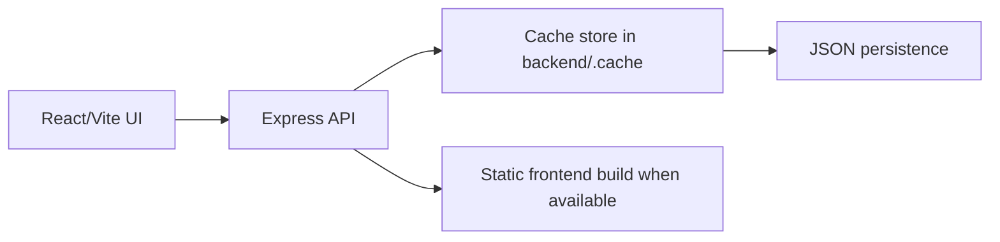

# CitiFix 2.0

A civic issue reporting app with a React frontend, Express backend, and cache-backed persistence. The app is designed to run without a live database in production-style deployments.

Live demo: https://citifix2-0.vercel.app

Use this Aadhaar number for the demo flow: `123456654321`

## What It Does

CitiFix lets citizens report local issues, browse community complaints, vote on what matters most, and track resolution progress. Admin users can review, assign, and update complaint status from a dashboard.

The current runtime is intentionally database-free. Data is stored in a local cache file on the backend, so the app can run on ordinary hosting without PostgreSQL or Prisma migrations.

## Current Architecture



Frontend responsibilities:

- Landing, login, register, citizen, and admin screens
- API calls through the shared client layer
- Responsive UI built with Tailwind and Framer Motion

Backend responsibilities:

- Authentication and session token issuance
- Complaint creation, voting, updates, and leaderboard data
- Admin analytics and status management
- Health check endpoint at `/api/health`

## Project Status

- Frontend: ready
- Backend: ready
- Database: not required for the live cache-backed mode
- Production serve path: backend serves the built frontend when `dist` exists

## Environment

Create these local-only files if they do not already exist:

### Root `.env`

```env
VITE_API_BASE_URL=
```

### `backend/.env`

```env
JWT_SECRET=replace-with-a-long-random-secret
PORT=5000
```

The backend cache mode does not require `DATABASE_URL`.

## Install

```bash
npm install
npm --prefix backend install
```

## Run Locally

Start both apps:

```bash
npm run dev:all
```

Or run them separately:

```bash
npm run dev
npm --prefix backend start
```

Frontend runs on `http://localhost:3000`.
Backend runs on `http://localhost:5000`.

## Build

```bash
npm run build
```

The backend will serve the built frontend automatically when `dist/` is present.

## API Overview

- `POST /api/auth/register`
- `POST /api/auth/login`
- `GET /api/complaints`
- `POST /api/complaints`
- `POST /api/complaints/:id/vote`
- `GET /api/complaints/user/my-complaints`
- `GET /api/leaderboard`
- `GET /api/admin/analytics`

## Files Worth Knowing

- [frontend env example](.env.example)
- [backend env example](backend/.env.example)
- [backend entrypoint](backend/index.js)
- [cache store](backend/store.js)

## Notes

- The old PostgreSQL/Prisma path is still present in the repo history, but the live runtime does not depend on it.
- If you want to switch back to a database-backed deployment later, the backend layer is the place to start.
